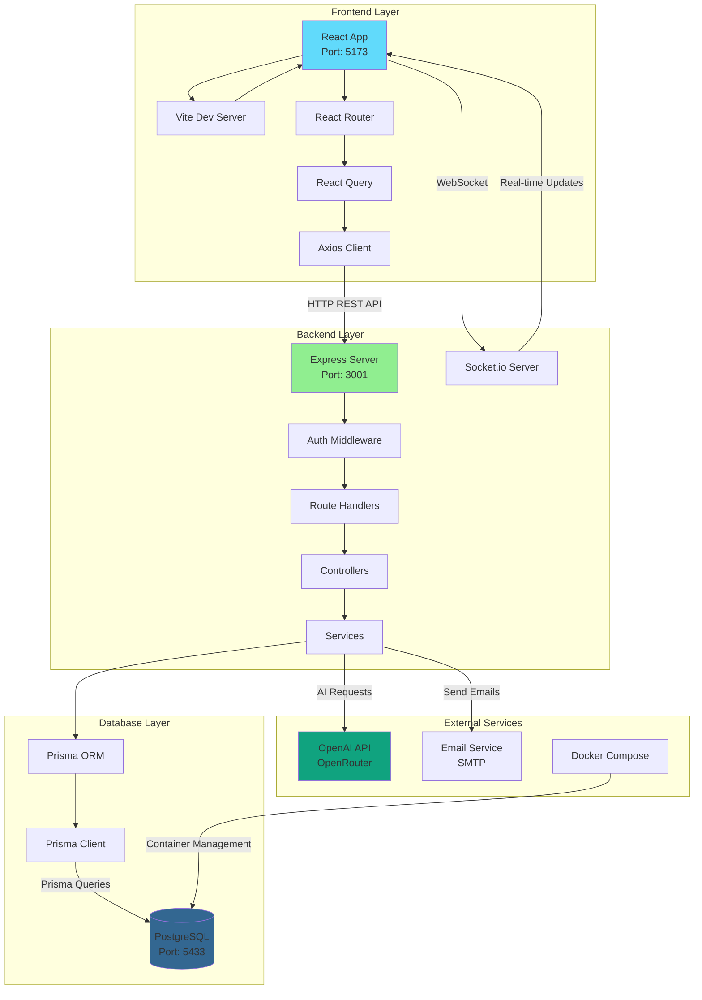
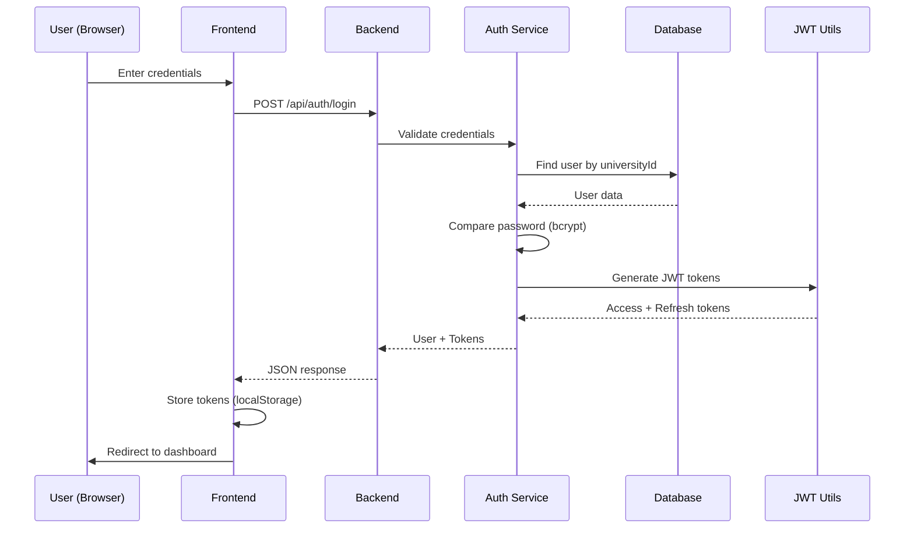
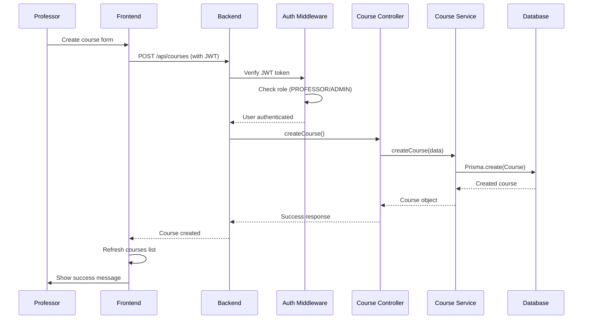
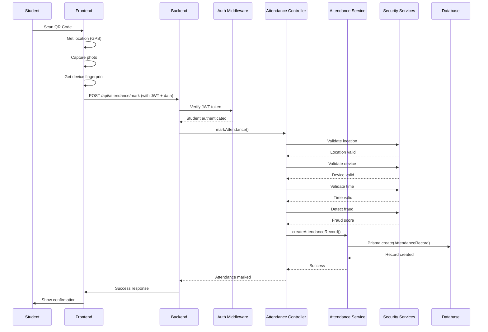

# 🏗️ خريطة المعمارية - Smart Campus Assistant

## مخطط معماري شامل

### المخطط الرئيسي



---

## مخطط تدفق البيانات

### تسجيل الدخول



### إنشاء كورس جديد



### تسجيل الحضور (QR Code)



---

## المكونات الرئيسية

### 1. Frontend (React + Vite)

**الموقع**: `src/`

**المكونات الرئيسية**:

- **Pages**: `src/pages/` - صفحات التطبيق الرئيسية
- **Components**: `src/components/` - مكونات قابلة لإعادة الاستخدام
- **Services**: `src/services/` - طبقة API والخدمات
- **Hooks**: `src/hooks/` - React hooks مخصصة
- **Contexts**: `src/contexts/` - React contexts
- **Utils**: `src/utils/` - وظائف مساعدة

**المنافذ المستخدمة**:

- `5173` - Vite Dev Server (Development)
- `4173` - Vite Preview (Production preview)

**كيف يتواصل**:

- HTTP REST API مع Backend على `http://localhost:3001/api`
- WebSocket مع Socket.io Server على نفس المنفذ
- Axios للطلبات HTTP
- React Query لإدارة حالة السيرفر

---

### 2. Backend (Node.js + Express)

**الموقع**: `server/` و `src/routes/`, `src/controllers/`, `src/services/`

**البنية**:

```
server/
├── index.ts              # نقطة الدخول الرئيسية
├── api/                  # API routes إضافية
└── ...

src/
├── routes/               # Route definitions
│   ├── auth.routes.ts
│   ├── course.routes.ts
│   ├── attendance.routes.ts
│   └── ...
├── controllers/          # Request handlers
│   ├── auth.controller.ts
│   ├── course.controller.ts
│   └── ...
├── services/             # Business logic
│   ├── auth.service.ts
│   ├── course.service.ts
│   ├── attendance.service.ts
│   └── security/         # Security services
├── middleware/           # Express middleware
│   └── auth.middleware.ts
└── utils/                # Utility functions
    └── jwt.ts
```

**المنافذ المستخدمة**:

- `3001` - HTTP Server
- نفس المنفذ لـ WebSocket (Socket.io)

**كيف يتواصل**:

- يستقبل طلبات HTTP من Frontend
- يتواصل مع قاعدة البيانات عبر Prisma
- يتواصل مع OpenAI API للذكاء الاصطناعي
- يرسل إشعارات فورية عبر WebSocket

---

### 3. Database (PostgreSQL + Prisma)

**الموقع**: `prisma/schema.prisma`

**النماذج الرئيسية**:

- `User` - المستخدمون (طلاب، أساتذة، إداريون)
- `Course` - الكورسات
- `CourseEnrollment` - تسجيل الطلاب في الكورسات
- `Schedule` - الجداول الزمنية
- `AttendanceRecord` - سجلات الحضور
- `QRCode` - رموز QR للحضور
- `Notification` - الإشعارات
- `ChatSession` - جلسات المحادثة
- `FraudAlert` - تنبيهات الغش

**المنافذ المستخدمة**:

- `5432` - داخل Docker container
- `5433` - على Host machine (mapped port)

**كيف يتواصل**:

- Prisma ORM يترجم استعلامات JavaScript إلى SQL
- PostgreSQL يقوم بتنفيذ الاستعلامات وإرجاع النتائج

---

### 4. External Services

#### OpenAI API (OpenRouter)

- **الاستخدام**: المساعد الذكي (Chatbot)
- **API Key**: `OPENAI_API_KEY` في `.env`
- **Base URL**: `https://openrouter.ai/api/v1`
- **Model**: `deepseek/deepseek-chat`

#### Email Service (SMTP)

- **الاستخدام**: إرسال الإشعارات عبر البريد الإلكتروني
- **الإعداد**: `SMTP_*` variables في `.env`

#### Docker Compose

- **الاستخدام**: إدارة قاعدة البيانات PostgreSQL
- **الملف**: `docker-compose.yml`

---

## تدفق الطلبات

### 1. طلب مصادق (Authenticated Request)

```
Frontend Request
    ↓
Express Server (server/index.ts)
    ↓
CORS Middleware
    ↓
Body Parser
    ↓
Auth Middleware (verify JWT)
    ↓
Route Handler (src/routes/*.ts)
    ↓
Controller (src/controllers/*.ts)
    ↓
Service (src/services/*.ts)
    ↓
Prisma Client
    ↓
PostgreSQL Database
    ↓
Response back through layers
```

### 2. طلب غير مصادق (Public Request)

```
Frontend Request
    ↓
Express Server
    ↓
CORS Middleware
    ↓
Body Parser
    ↓
Public Route (no auth required)
    ↓
Controller
    ↓
Service
    ↓
Database (if needed)
    ↓
Response
```

---

## الأمان

### طبقات الحماية

1. **Network Layer**:

   - CORS protection
   - Rate limiting
   - Firewall rules

2. **Application Layer**:

   - JWT authentication
   - Role-based access control (RBAC)
   - Input validation
   - SQL injection protection (Prisma)

3. **Data Layer**:

   - Password hashing (bcrypt)
   - Encrypted connections (HTTPS in production)
   - Secure token storage

4. **Business Logic Layer**:
   - Fraud detection
   - Location validation
   - Device fingerprinting
   - Time validation

---

## Real-time Features

### WebSocket (Socket.io)

**الاستخدامات**:

- إشعارات الحضور الفورية
- تحديثات الحضور المباشرة
- تنبيهات الأمان
- تحديثات الدردشة

**التدفق**:

```
Client connects to Socket.io
    ↓
Server authenticates connection (JWT)
    ↓
Client joins rooms (user-specific, course-specific)
    ↓
Server emits events when data changes
    ↓
Clients receive updates in real-time
```

---

## التخزين المؤقت (Caching)

### Frontend Caching

- React Query cache للبيانات من API
- localStorage للمعلومات المحلية
- Session storage للبيانات المؤقتة

### Backend Caching

- يمكن إضافة Redis للتخزين المؤقت (مستقبلاً)
- في-memory caching للبيانات الشائعة

---

## Monitoring & Logging

### Logging

- **Development**: Console logs
- **Production**: File logs + structured logging
- **Morgan**: HTTP request logging

### Monitoring

- Health check endpoint: `/health`
- Error tracking
- Performance metrics

---

## Deployment Architecture

### Development

```
Local Machine
├── Frontend (Vite Dev Server)
├── Backend (Node.js/Express)
└── Database (Docker Container)
```

### Production (Recommended)

```
Load Balancer (Nginx)
├── Frontend (Static files served by Nginx)
├── Backend (Node.js cluster)
└── Database (PostgreSQL on separate server)
    └── Redis (Caching)
    └── Backup Server
```

---

## Scalability Considerations

### Horizontal Scaling

- Frontend: CDN + Static hosting
- Backend: Multiple instances behind load balancer
- Database: Read replicas + Connection pooling

### Vertical Scaling

- Increase server resources
- Optimize database queries
- Implement caching strategies

---

## Security Best Practices

1. **Authentication**: JWT tokens with refresh tokens
2. **Authorization**: Role-based access control
3. **Input Validation**: Validate all user inputs
4. **SQL Injection**: Use Prisma (parameterized queries)
5. **XSS Protection**: Sanitize user inputs
6. **CSRF Protection**: Use CSRF tokens
7. **Rate Limiting**: Prevent abuse
8. **HTTPS**: Encrypt all communications
9. **Secrets Management**: Use environment variables
10. **Regular Updates**: Keep dependencies updated

---

**آخر تحديث**: يناير 2025
